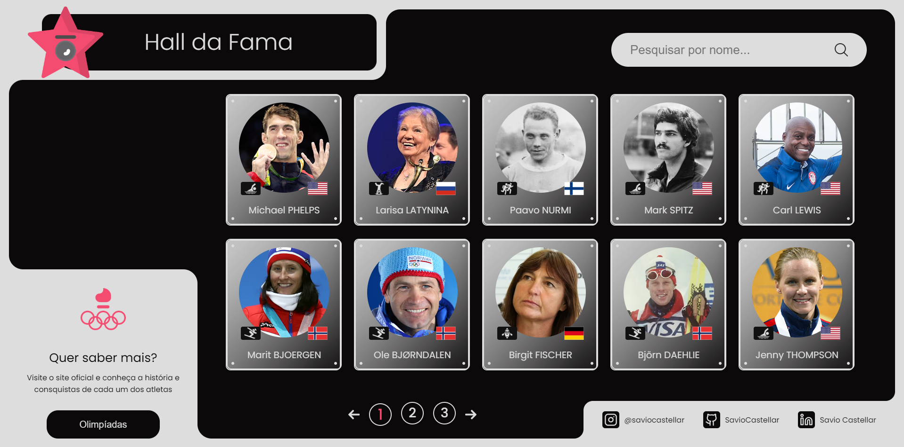
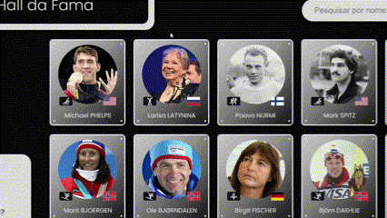
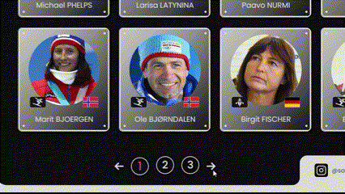

# Hall da Fama Olímpico
Este projeto é uma aplicação de galeria de atletas que marcaram seu nome na história das Olimpíadas, focada na exibição de cards com informações visuais e modais interativos para cada atleta. O projeto foi desenvolvido como parte de um concurso de programação básica, com o objetivo de mostrar o uso de tecnologias fundamentais como HTML, CSS e JavaScript, aliado ao suporte de inteligência artificial para auxiliar na criação e otimização do código.




# :hammer: Funcionalidades do projeto

- `Funcionalidade 1`: Exibição de cards de atletas
A página principal apresenta uma galeria de cards com os atletas mais renomados da história do esporte. Cada card contém:

    . Uma imagem do atleta.
    . Ícones das modalidades esportivas e bandeiras que representam o país do atleta.
    . Nome do atleta exibido em destaque.

- `Funcionalidade 2`: Modal de informações detalhadas
Ao clicar em um card de atleta, é exibido um modal dinâmico que contém mais detalhes sobre o atleta, como:

    . Uma imagem em destaque do atleta.
    . Resultados de medalhas conquistadas (quantidade de ouro, prata e bronze).
    . Biografia básica com informações como o número de participações, ano de nascimento, e a primeira edição olímpica do atleta.

    

- `Funcionalidade 3`: Sistema de Paginação
    A galeria utiliza um sistema de paginação, permitindo que o usuário navegue por diferentes páginas de atletas. Na parte inferior da tela, há botões para navegar entre as páginas com ícones de seta para facilitar a navegação.

    

- `Funcionalidade 4`: Campo de Pesquisa
    Na parte superior direita, há um campo de pesquisa que permite ao usuário buscar atletas pelo nome. A funcionalidade de busca é feita utilizando JavaScript para filtrar e exibir dinamicamente os resultados na galeria.

    


## ✔️ Tecnologias utilizadas
- `HTML`: Para a estruturação dos elementos da página.
- `CSS`: Para o design, incluindo responsividade e estilos personalizados dos cards e modais.
- `JavaScript`: Para a criação da interatividade, incluindo a abertura do modal ao clicar no card e a funcionalidade de pesquisa e paginação.

## :bulb: Técnicas utilizadas com ajuda do Google Gemini


## :file_folder: Estrutura de Pastas
O projeto está organizado da seguinte forma:
```
HALL-DA-FAMA/
│
├── imagens/          # Contém as imagens dos atletas utilizadas no projeto
│
├── js/               # Contém os scripts JavaScript
│   ├── app.js        # Lida com a lógica principal do projeto, como a exibição de modais e interações
│   └── dados.js      # Contém os dados dos atletas, como nomes, resultados e biografias
│
├── index.html        # Arquivo HTML principal que estrutura a página
│
├── style.css         # Arquivo de estilos para customizar o layout e design da página
```

Descrição dos Arquivos:
- `imagens/`: Pasta onde estão armazenadas as fotos dos atletas que são exibidas nos cards.
- `js/app.js`: Arquivo principal de JavaScript responsável pela lógica de interação da página, como exibir o modal de detalhes dos atletas e controlar a paginação.
- `js/dados.js`: Arquivo onde os dados dos atletas estão armazenados (como nome, medalhas e biografia), simulando uma fonte de dados interna.
- `index.html`: Estrutura o conteúdo da página, incluindo a disposição dos cards dos atletas e outros elementos HTML.
- `style.css`: Define o layout da página, os estilos dos cards, do modal e de outros componentes visuais.

## :computer: Acesso ao projeto

1. Clone este repositório:
```
git clone https://github.com/seu-usuario/hall-da-fama.git
```

2. Abra o arquivo `index.html` diretamente em seu navegador.
